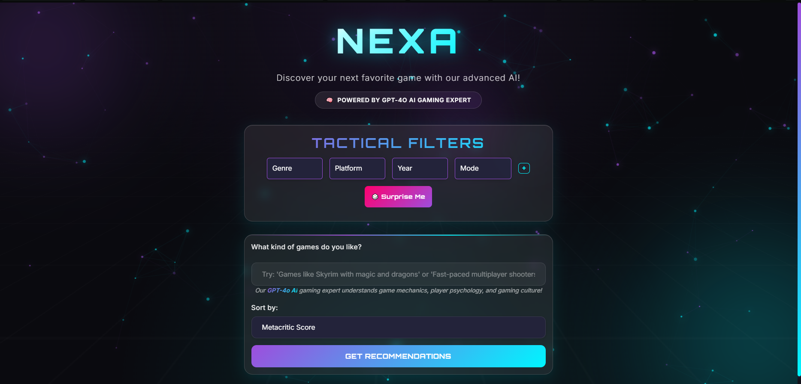
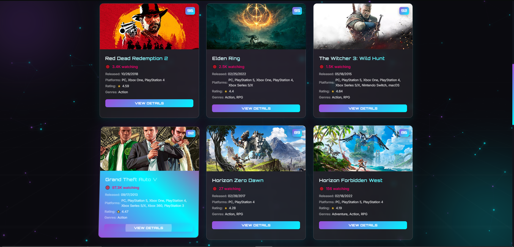
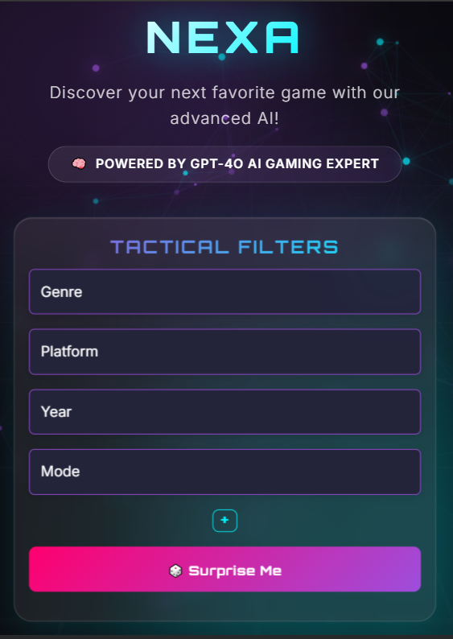
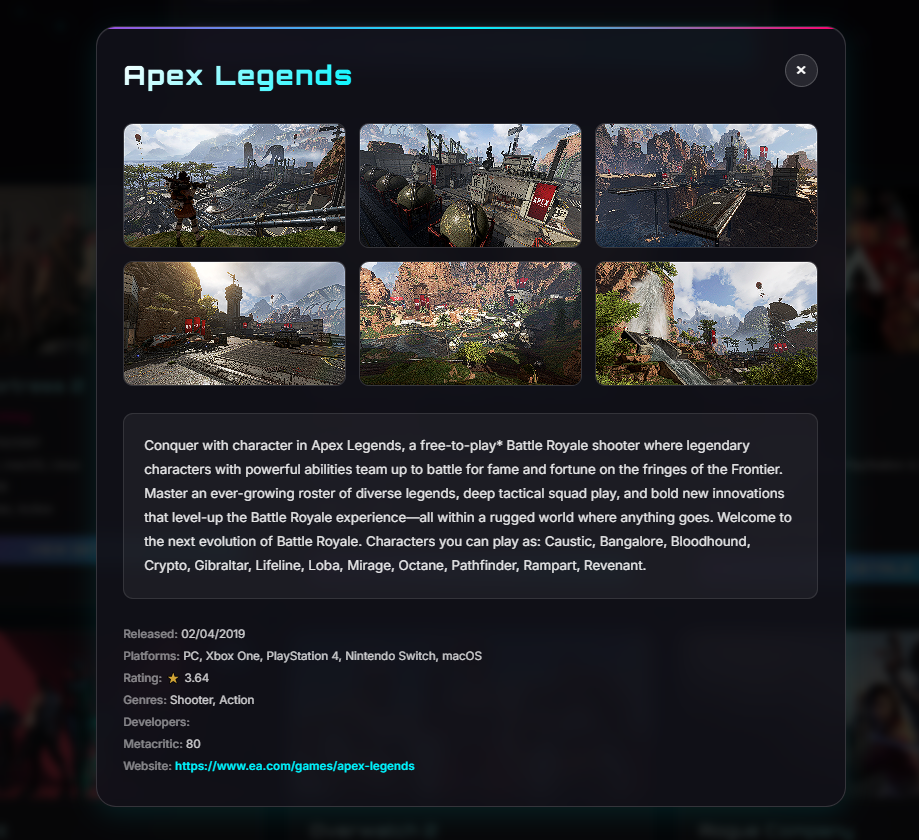
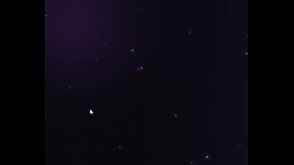

# 🎮 NEXA - AI-Powered Game Recommender

[](https://python.org)
[](https://reactjs.org)
[](https://fastapi.tiangolo.com)
[](LICENSE)
[](https://railway.app)
[](https://nexa-pro.up.railway.app)

A modern, AI-powered web application that recommends video games based on user preferences using GPT-4o and multiple gaming APIs. Built with FastAPI backend and React frontend.

## ✨ Features

- 🤖 **AI-Powered Recommendations**: Uses GPT-4o to provide intelligent game suggestions
- 🎯 **Smart Matching**: Finds exact game matches and provides similar recommendations
- 📊 **Multiple Data Sources**: Integrates RAWG, IGDB, and Twitch APIs for comprehensive game data
- 📺 **Real-time Data**: Includes Twitch viewer counts and current gaming trends
- 🎨 **Modern UI**: React-based frontend with smooth animations and dark theme
- 📱 **Responsive Design**: Works seamlessly on desktop and mobile devices
- ⚡ **Fast Performance**: Built with FastAPI for high-performance async operations
- 🔒 **Rate Limiting**: Built-in protection against API abuse

## 🖼️ Visual Preview

### 🎯 Main Interface

*Modern gaming-inspired UI with neon gradients and glass morphism effects*

### 🎲 Game Recommendations

*AI-powered game suggestions with real-time Twitch viewer data*

### 📱 Responsive Design

*Fully responsive design that works seamlessly on all devices*

### 🔍 Game Details Modal

*Comprehensive game information with screenshots and metadata*

---

## 🚀 UI Feature Showcase

### 🎛️ Dynamic Filters

*Interactively filter games by genre, platform, year, and mode with smooth animations.*

### 🪟 Modal Animation

*Seamless modal transitions for detailed game information, including screenshots and metadata.*

### ✨ Interactive Background Dots

*Animated, interactive background dots create a futuristic and immersive visual experience.*

---

## 🛠️ Tech Stack

### Backend
- **FastAPI** (Python) - High-performance async web framework
- **Uvicorn** - ASGI server
- **aiohttp** - Async HTTP client
- **Pydantic** - Data validation and serialization
- **Python-dotenv** - Environment variable management

### Frontend
- **React 18** - Modern JavaScript framework
- **Tailwind CSS** - Utility-first CSS framework
- **Axios** - HTTP client for API calls
- **Headless UI** - Accessible UI components
- **Heroicons** - Beautiful SVG icons

### APIs & Services
- **OpenAI GPT-4o** - AI-powered game recommendations
- **RAWG** - Game database and metadata
- **IGDB** - Game search and autocomplete
- **Twitch** - Live streaming data and viewer counts

## 🚀 Quick Start

### Prerequisites
- Python 3.9 or higher
- Node.js 16 or higher
- npm or yarn package manager

### 1. Clone the Repository
```bash
git clone https://github.com/deziikuoo/NEXA-v1.git
cd NEXA-v1
```

### 2. Backend Setup

1. **Install Python dependencies:**
   ```bash
   pip install -r requirements.txt
   ```

2. **Set up environment variables:**
   
   **Option A: Interactive Setup (Recommended)**
   ```bash
   python setup_env.py
   ```
   This will guide you through entering your API keys interactively.
   
   **Option B: Manual Setup**
   ```bash
   cp .env.example .env
   ```
   
   Edit `.env` and add your API keys:
   ```env
   OPENAI_API_KEY=your_openai_api_key_here
   RAWG_API_KEY=your_rawg_api_key_here
   TWITCH_CLIENT_ID=your_twitch_client_id_here
   TWITCH_CLIENT_SECRET=your_twitch_client_secret_here
   IGDB_CLIENT_ID=your_igdb_client_id_here
   IGDB_CLIENT_SECRET=your_igdb_client_secret_here
   ```

3. **Start the FastAPI server:**
   ```bash
   python start.py
   ```
   
   The backend will be available at `http://localhost:8000`

### 3. Frontend Setup

1. **Install Node.js dependencies:**
   ```bash
   npm install
   ```

2. **Start the development server:**
   ```bash
   npm start
   ```

3. **Open your browser:**
   Navigate to `http://localhost:3000`

### 4. Alternative: Run Both Together
```bash
npm run start
```
This will start both frontend and backend concurrently.

### 5. 🌐 Try the Live Demo
Don't want to set up locally? Try the live application:
**🎮 [https://nexa-pro.up.railway.app](https://nexa-pro.up.railway.app)**

## 🔧 API Keys Setup

### Required API Keys

1. **OpenAI API Key**
   - Visit [OpenAI Platform](https://platform.openai.com/api-keys)
   - Create a new API key
   - Add to `.env` as `OPENAI_API_KEY`

2. **RAWG API Key**
   - Visit [RAWG API](https://rawg.io/apidocs)
   - Sign up and get your API key
   - Add to `.env` as `RAWG_API_KEY`

3. **Twitch API Credentials**
   - Visit [Twitch Developer Console](https://dev.twitch.tv/console)
   - Create a new application
   - Get Client ID and Client Secret
   - Add to `.env` as `TWITCH_CLIENT_ID` and `TWITCH_CLIENT_SECRET`

4. **IGDB API Credentials** (Optional)
   - Uses Twitch credentials by default
   - Can be set separately if needed

## 🚀 Deployment

### Railway Deployment (Recommended)

1. **Fork this repository** to your GitHub account
2. **Connect to Railway:**
   - Visit [Railway](https://railway.app)
   - Click "New Project" → "Deploy from GitHub repo"
   - Select your forked repository
3. **Set environment variables** in Railway dashboard
4. **Deploy!** Railway will automatically build and deploy your app

**🎮 Live Demo**: [https://nexa-pro.up.railway.app](https://nexa-pro.up.railway.app)

### Docker Deployment

1. **Build the Docker image:**
   ```bash
   docker build -t nexa-game-recommender .
   ```

2. **Run the container:**
   ```bash
   docker run -p 8000:8000 --env-file .env nexa-game-recommender
   ```

### Manual Deployment

1. **Build the frontend:**
   ```bash
   npm run build
   ```

2. **Start the production server:**
   ```bash
   python start.py
   ```

## 📚 API Documentation

### Endpoints

- `GET /` - Root endpoint with API information
- `GET /health` - Health check endpoint
- `POST /api/recommendations` - Get game recommendations
- `POST /api/game-details` - Get detailed game information
- `GET /api/igdb-autocomplete` - Game search autocomplete
- `GET /api/test-gpt4o` - Test GPT-4o integration

### Example Usage

```bash
# Get game recommendations
curl -X POST "http://localhost:8000/api/recommendations" \
  -H "Content-Type: application/json" \
  -d '{"preference": "RPG games like Skyrim", "sort_by": "rating"}'

# Get game details
curl -X POST "http://localhost:8000/api/game-details" \
  -H "Content-Type: application/json" \
  -d '{"title": "The Elder Scrolls V: Skyrim"}'
```

## 🎯 Usage Guide

1. **Enter your preference** - Describe what kind of games you're looking for
   - Examples: "RPG games", "action games like GTA", "similar to Skyrim"
2. **Select sorting options** - Choose how to sort results (release date, rating, etc.)
3. **Get recommendations** - Click "Get Recommendations" or press Enter
4. **Browse results** - View AI-curated game suggestions with detailed information
5. **Explore details** - Click on any game to view comprehensive information

## 🏗️ Architecture

The application uses a hybrid recommendation system:

- **Exact Matching**: Searches for specific games and finds similar ones
- **AI Recommendations**: GPT-4o provides intelligent suggestions based on preferences
- **Multi-Source Data**: Combines data from RAWG, IGDB, and Twitch APIs
- **Real-time Updates**: Includes current Twitch viewer counts and trending data
- **Rate Limiting**: Built-in protection against API abuse

## 🤝 Contributing

We welcome contributions! Please see our [Contributing Guide](.github/CONTRIBUTING.md) for details.

1. Fork the repository
2. Create a feature branch (`git checkout -b feature/amazing-feature`)
3. Commit your changes (`git commit -m 'Add amazing feature'`)
4. Push to the branch (`git push origin feature/amazing-feature`)
5. Open a Pull Request

## 📝 License

This project is licensed under the MIT License - see the [LICENSE](LICENSE) file for details.

## 🙏 Acknowledgments

- [RAWG](https://rawg.io/) for comprehensive game data
- [IGDB](https://www.igdb.com/) for game search capabilities
- [Twitch](https://www.twitch.tv/) for live streaming data
- [OpenAI](https://openai.com/) for GPT-4o AI capabilities
- [Railway](https://railway.app/) for easy deployment

## 🌐 Live Demo

**🎮 Try NEXA Game Recommender now!**
- **Live Application**: [https://nexa-pro.up.railway.app](https://nexa-pro.up.railway.app)

## 📞 Support

- **Issues**: [GitHub Issues](https://github.com/deziikuoo/NEXA-v1/issues)
- **Discussions**: [GitHub Discussions](https://github.com/deziikuoo/NEXA-v1/discussions)
- **Email**: IfDawanPrintQualified14@gmail.com

## 📊 Project Status


---

⭐ **Star this repository if you find it helpful!**
